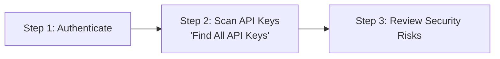
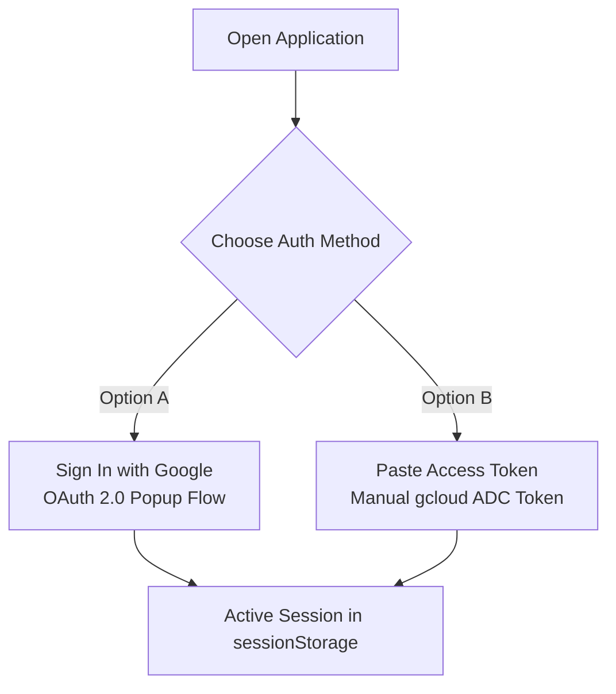
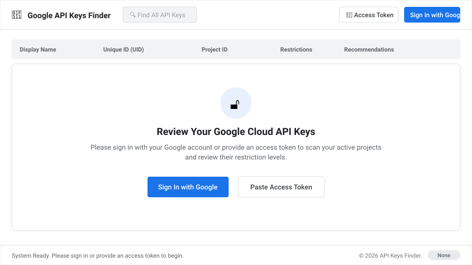
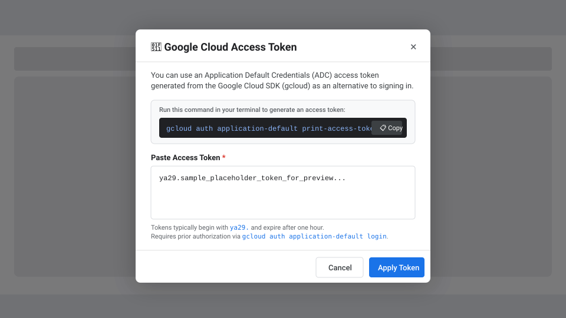
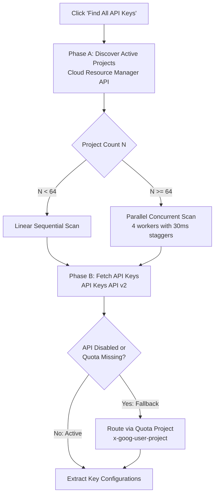
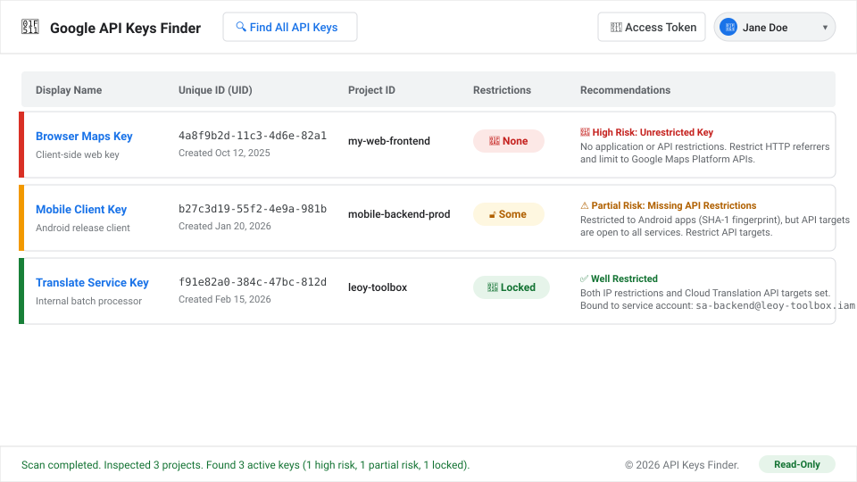

# Google Cloud API Keys Finder

[](https://github.com/minherz/api-keys-finder/actions/workflows/ci.yml)

An ultra-lightweight, high-performance Single Page Application (SPA) designed to audit and inspect active API keys across all accessible Google Cloud projects. Running entirely inside the browser with **zero backend dependencies**, it communicates directly with Google Cloud REST APIs to perform real-time key discovery, security categorization, and restriction audits.

API keys in Google Cloud are publicly readable credentials by design. As emphasized in the Google Cloud Blog post [API keys are open secrets](https://cloud.google.com/blog/topics/developers-practitioners/api-keys-are-open-secrets), securing API keys requires applying strict application restrictions (limiting where the key can be used) and API restrictions (limiting what the key can call). This application automates discovering and reviewing those restrictions across your entire Google Cloud resource hierarchy.

---

## 📑 Table of Contents

* [⚙️ How It Works](#️-how-it-works)
* [🛠️ Building and Running Locally](#️-building-and-running-locally)
* [🔒 Security & Privacy](#-security--privacy)
* [🚀 Deployment](#-deployment)
* [🎛️ Diagnostic Configuration & Developer Controls](#️-diagnostic-configuration--developer-controls)
* [📂 Project Structure](#-project-structure)

---

## ⚙️ How It Works

From the user experience perspective, the application follows a simple three-step journey:



### Step 1: Authentication (Sign In with Google or Paste Access Token)
The user begins on the landing screen by selecting an authentication method:





* **Option A: Sign In with Google (OAuth 2.0):** Opens a standard Google Identity Services popup window. The user authorizes read-only access (`cloud-platform.read-only`, `userinfo.profile`, `userinfo.email`). Upon completion, the token is passed securely to the application via `postMessage`, and the user profile (name and avatar) is rendered in the top toolbar.
* **Option B: Paste Access Token (ADC):** The user clicks the **Access Token** button and pastes an Application Default Credentials token generated locally via `gcloud auth application-default print-access-token`. The application validates that the token format starts with `ya29.` and activates manual session mode:



> [!IMPORTANT]
> Tokens and active session states are stored strictly in browser memory and ephemeral `sessionStorage`.

### Step 2: Scanning for API Keys
From the end-user perspective, scanning is a single action: clicking **Find All API Keys** starts the automated audit and presents a unified progress bar.

Under the hood, the following operations take place:



#### Phase A: Discovering Active Projects
The scanner first calls the **Cloud Resource Manager API** to discover all accessible projects:
* **REST API:** `GET https://cloudresourcemanager.googleapis.com/v1/projects`
* Client-side filtering ensures only projects in the `ACTIVE` lifecycle state are audited, ignoring projects pending deletion.
* **`gcloud` CLI Equivalent:**
  ```bash
  gcloud projects list --filter="lifecycleState:ACTIVE"
  ```

#### Phase B: Fetching API Keys & Inspecting Restrictions
Once projects are identified, the application queries the **API Keys API v2** across all discovered projects to list active keys and retrieve their restriction configurations:
* **REST API:** `GET https://apikeys.googleapis.com/v2/projects/{projectId}/locations/global/keys`
* **`gcloud` CLI Equivalent:**
  ```bash
  gcloud services api-keys list --project=<PROJECT_ID>
  ```

#### Execution Strategy: Linear vs. Parallel
To optimize performance without overwhelming the browser or Google's API gateways, the scanner dynamically selects an execution engine based on the total project count $N$ against a configurable threshold (default: `64`):
* **Linear Sequential Execution ($N < 64$):** For smaller project sets, requests are dispatched sequentially and deterministically.
* **Parallel Concurrent Execution ($N \ge 64$):** For larger project lists, queries are processed across **4 concurrent worker queues** in batches of 12. Each worker startup is staggered by a **$30\text{ms}$ delay** to prevent Google Front End (GFE) rate-limit spikes. If a transient gateway collision occurs (`403` without error details), the scanner automatically pauses and retries with exponential backoff and randomized jitter.

#### Fallback Handling: Quota Project & Permission Resolution
When auditing multiple Google Cloud projects with end-user credentials, two common obstacles occur:
1. The API Keys API (`apikeys.googleapis.com`) is not explicitly activated on every scanned project, causing direct calls to fail with a `SERVICE_DISABLED` (403) error.
2. The API requires a designated quota project to bill API usage against.

**The Fallback Mechanism:**
* The scanner monitors project responses and detects the first accessible project where the API Keys API is actively enabled, designating it as the **Quota Project** (`quotaProjectId`).
* For all subsequent projects where the API is not activated or direct quota is unavailable, the application automatically attaches the `x-goog-user-project: <quotaProjectId>` HTTP header to the request.
* Google's API Gateway routes the service enablement check through the active quota project. This allows the scanner to inspect keys across target projects without requiring administrators to manually enable the API Keys API on every project in the organization.

### Step 3: Reviewing Security Risks and Recommendations
After keys are retrieved, the application evaluates each key's restriction configuration against Google Cloud security best practices:
* **Application Restrictions:** Restricting usage by HTTP referrers (websites), IPv4/IPv6 addresses (web servers/daemons), Android package fingerprints, or iOS bundle IDs.
* **API Restrictions:** Explicitly scoping the key to only the specific Google APIs required by the workload.
* **Service Account Binding:** Associating the API key with an IAM Service Account identity.

Keys are categorized into four security levels:
* **🚨 None (Unrestricted):** Neither application nor API restrictions are configured. Flagged as **High Risk**.
* **🔓 Some (Partially Restricted):** Only one restriction dimension is configured (e.g. restricted by HTTP referrers, but unrestricted in API targets). Flagged as **Partial Risk**.
* **🔒 Restricted (Fully Restricted):** Both application restrictions and API restrictions are in place.
* **🔐 Locked:** Both restriction dimensions are enforced, and the key is bound to a dedicated Service Account.

Results are presented in an interactive table with one-click copy buttons for key identifiers, direct links to the Google Cloud Console, and actionable security recommendations:



---

## 🛠️ Building and Running Locally

### Prerequisites: Access Token Setup
The application requires an authenticated identity with permission to inspect GCP resources. You can either generate an OAuth Client ID and use allowed user account credentials to sign-in or to set up necessary permissions and paste the access token of the Application Default Credentials (ADC).

#### Method A: Generate OAuth 2.0 Web Client
To generate an OAuth Client ID do the following:

1. **Select or Create a Google Cloud Project:**
   Choose a project that will host your credentials (e.g. `my-toolbox-project`).
2. **Enable the API Keys API:**
   ```bash
   gcloud services enable apikeys.googleapis.com --project=<PROJECT_ID>
   ```
3. **Configure the OAuth Consent Screen:**
   * Go to **APIs & Services > OAuth consent screen** in Google Cloud Console.
   * The publishing status **must** be set to **Testing**.
   * Under **Test users**, add the email addresse(s) of user account(s) that you plan to use for sign-in.
4. **Create an OAuth 2.0 Client ID:**
   * Go to **APIs & Services > Credentials > Create Credentials > OAuth client ID**.
   * Select **Web application** as the Application type.
   * Under **Authorized JavaScript origins**, add your local development origins:
     * `http://localhost:5173` (Vite dev server)
     * `http://localhost:4173` (Vite preview server)
   * Click **Create** and copy the Client ID (`<project-number>-<hash>.apps.googleusercontent.com`).

*(Note: Because this OAuth Client ID is registered within your project, Google implicitly trusts it to use your project as the quota project. No extra IAM quota role is needed on your user account.)*

#### Method B: Application Default Credentials (ADC Access Token)
This method allows running the application locally without creating an OAuth Client ID, using an access token generated from your terminal via `gcloud`.

1. **Log in to Application Default Credentials:**
   Run the interactive login command in your terminal:
   ```bash
   gcloud auth application-default login
   ```
2. **Grant Quota Project Permission:**
   Because ADC tokens use Google's generic Cloud SDK client ID, Google Cloud API gateways require the user identity to have explicit permission to consume quota (`serviceusage.services.use`) on the project being billed.
   
   Grant the **Service Usage Consumer** role on your designated project to your user account:
   ```bash
   gcloud projects add-iam-policy-binding <PROJECT_ID> \
     --member="user:<YOUR_EMAIL>" \
     --role="roles/serviceusage.serviceUsageConsumer"
   ```
3. **Print the Access Token:**
   ```bash
   gcloud auth application-default print-access-token
   ```
   Copy the output token (which starts with `ya29.`) and paste it into the application's **Access Token** dialog.


### Environment Setup (`.env`)

The application enforces the `VITE_GOOGLE_OAUTH_CLIENT_ID` environment variable at build and development time. Create a `.env` file in the project root:

```bash
cp .env.example .env  # or create a new .env file
```

Configure `VITE_GOOGLE_OAUTH_CLIENT_ID` depending on your chosen authentication method:

* **If using Method A (Google Sign-In):**
  Set the variable to your registered Google OAuth Client ID:
  ```env
  VITE_GOOGLE_OAUTH_CLIENT_ID="123456789000-abcdef123456.apps.googleusercontent.com"
  ```
* **If using Method B (ADC Access Token exclusively):**
  You do not need a real OAuth Client ID. However, because the Vite build configuration validates the variable format using `/^[0-9]+-[a-zA-Z0-9_-]+\.apps\.googleusercontent\.com$/`, supply a dummy Client ID matching this pattern:
  ```env
  VITE_GOOGLE_OAUTH_CLIENT_ID="123456789000-dummyclientid00000000000000000.apps.googleusercontent.com"
  ```

*(Optional: Set `VITE_APP_VERSION` to customize the footer build tag, e.g. `VITE_APP_VERSION="v0.0.1+local"`).*

---

### Development Commands

```bash
# 1. Install dependencies
npm install

# 2. Start local development server (runs on http://localhost:5173/api-keys/)
npm run dev

# 3. Execute unit test suite (Vitest)
npm test

# 4. Build production bundle to dist/
npm run build

# 5. Preview production build locally (runs on http://localhost:4173/api-keys/)
npm run preview
```

---

## 🔒 Security & Privacy

### 1. Client-Side Execution & Data Privacy
* **Zero Backend Storage or Transmission:** The application runs **100% client-side** inside the browser. No user profiles, project IDs, or API keys are ever transmitted to or stored on external servers, third-party databases, or analytics services. All network requests are made directly between your browser and official Google Cloud REST APIs.
* **Ephemeral Session Storage:** All authentication tokens and active session states are stored strictly in memory and browser `sessionStorage`. **No user data is persisted after the browser window or tab is closed.**
* **Explicit Session Revocation:** Clicking **Sign Out** immediately wipes the local session and cached tokens from memory and `sessionStorage`, while issuing an explicit token revocation request to Google's OAuth 2.0 authorization server.

### 2. OAuth 2.0 Scopes
The application adheres strictly to the **Principle of Least Privilege**. When signing in, the application requests only non-destructive, read-only scopes:

| OAuth Scope | Type | Purpose / Justification |
| :--- | :--- | :--- |
| `openid` | Identity | Authenticates user identity via OpenID Connect. |
| `.../auth/userinfo.profile` | Identity | Retrieves user display name and avatar for the header profile menu. |
| `.../auth/userinfo.email` | Identity | Retrieves user email address for display in account details. |
| `https://www.googleapis.com/auth/cloud-platform.read-only` | GCP | Provides strictly **read-only** access to list accessible projects (`Cloud Resource Manager API`) and inspect API key metadata and restrictions (`API Keys API`). |

> [!NOTE]
> The application does **not** request broad write or administrative permissions (`cloud-platform`). It cannot create, edit, modify, or delete any GCP resources or API keys.

### 3. IAM Permissions & Role Requirements
Access control and resource discovery are governed by Google Cloud IAM:
* **Project Visibility:** The scanner only discovers GCP projects that your identity has permissions to list via the Cloud Resource Manager API (`resourcemanager.projects.get` or `roles/browser` / `roles/viewer`).
* **Key Inspection Permissions:** The authenticated identity requires permissions equivalent to the **API Keys Viewer** (`roles/serviceusage.apiKeysViewer`) role (specifically `serviceusage.apiKeys.list` and `serviceusage.apiKeys.get`) on the targeted projects.
* **Quota Authorization (ADC mode):** The **Service Usage Consumer** (`roles/serviceusage.serviceUsageConsumer`) role on the designated quota project.

### 4. Zero Cost & Non-Billable APIs
All Google Cloud APIs invoked by this application ([Cloud Resource Manager API](https://cloud.google.com/resource-manager/docs) and [API Keys API](https://cloud.google.com/api-keys/docs)) are free of charge. Running scans across your projects incurs **zero Google Cloud billing costs**.

---

## 🚀 Deployment

### Path-Based Hosting
The application is configured with `base: '/api-keys/'` in `vite.config.ts` to support path-based reverse proxy hosting (e.g. `https://your-domain.com/api-keys/`).

### Static Hosting (Firebase Hosting)
The application can be deployed as static assets directly to Firebase Hosting:
```bash
# Build production bundle
npm run build

# Deploy using Firebase CLI
npx firebase-tools deploy --only hosting
```

### Containerized Hosting (Cloud Run)
The repository includes a production-ready container definition in `deploy/Dockerfile` using Nginx unprivileged:
```bash
# Build container image
docker build -t gcr.io/<PROJECT_ID>/api-keys-finder:latest -f deploy/Dockerfile .

# Run locally or deploy to Cloud Run
gcloud run deploy api-keys-finder \
  --image gcr.io/<PROJECT_ID>/api-keys-finder:latest \
  --platform managed \
  --region us-central1 \
  --allow-unauthenticated
```

### Firebase Hosting Rewrite to Cloud Run
When using Firebase Hosting to route traffic to Cloud Run, the **Firebase Hosting Service Agent** (`service-<PROJECT_NUMBER>@gcp-sa-firebasehosting.iam.gserviceaccount.com`) must have the **Cloud Run Invoker** (`roles/run.invoker`) role:
```bash
gcloud run services add-iam-policy-binding <SERVICE_NAME> \
  --member="serviceAccount:service-<PROJECT_NUMBER>@gcp-sa-firebasehosting.iam.gserviceaccount.com" \
  --role="roles/run.invoker"
```

### Production OAuth Client ID Configuration
When deploying to a public domain:
1. Open Google Cloud Console > **APIs & Services > Credentials**.
2. Edit your OAuth 2.0 Web Client ID.
3. Add your production domain (e.g. `https://your-domain.com`) to **Authorized JavaScript origins**.

---

## 🎛️ Diagnostic Configuration & Developer Controls

All verbose scanner telemetry is silenced by default in production. Developers can dynamically control logging verbosity and execution paths at runtime via browser **Developer Console (LocalStorage)**:

### 1. Enable Verbose Debug Logging
* **Enable:** Open DevTools Console (F12) and run:
  ```javascript
  localStorage.setItem('api_keys_scanner_debug', 'true')
  ```
  Then reload the page.
* **Disable:**
  ```javascript
  localStorage.removeItem('api_keys_scanner_debug')
  ```

### 2. Configure Path Selection Threshold (Testing Parallel Scans)
By default, the application runs sequential scanning if project count $N < 64$. To force parallel execution when testing with fewer projects:
* **Force Parallel Execution:** Drop threshold to `1`:
  ```javascript
  localStorage.setItem('api_keys_scanner_threshold', '1')
  ```
* **Restore Default (`64` projects):**
  ```javascript
  localStorage.removeItem('api_keys_scanner_threshold')
  ```

---

## 📂 Project Structure

```
/
├── .devcontainer/       # Dev container configuration for instant workspace setup
├── deploy/              # Cloud Run Dockerfile, Nginx config, and Firebase deployment specs
├── docs/                # Project documentation and architectural illustrations
│   └── images/          # SVG screen illustrations
├── index.html           # Main HTML5 entrypoint and layout structure for the SPA
├── skills-lock.json     # Version lockfile for Antigravity AI custom developer skills
├── vite.config.ts       # Vite bundler configuration and environment setup
├── vitest.config.ts     # Vitest test runner configuration for isolated unit testing
└── src/                 # Core application source code
    ├── api.ts           # Direct GCP REST API handshakes, customized errors, and headers
    ├── auth.ts          # Google OAuth 2.0 and manual access token session management
    ├── main.ts          # SPA orchestration, modal handling, and DOM rendering
    ├── scan-linear.ts   # Sequential scanner module with quota project routing
    ├── scan-parallel.ts # Concurrent parallel scanner with worker staggers & retries
    ├── style.css        # Clean, color-blind friendly modern CSS layout rules
    ├── types.ts         # Shared TypeScript interfaces for GCP resources and state
    ├── utils.ts         # Utility functions (date formatting, clipboard, token validation)
    └── vite-env.d.ts    # Ambient TypeScript declarations for Vite environment variables
```
